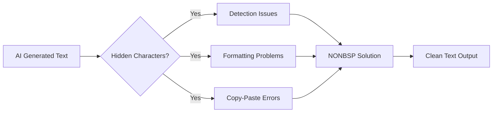
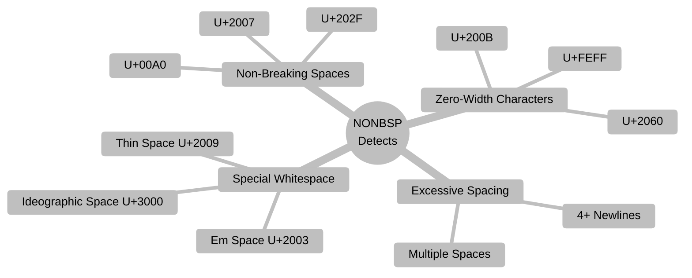
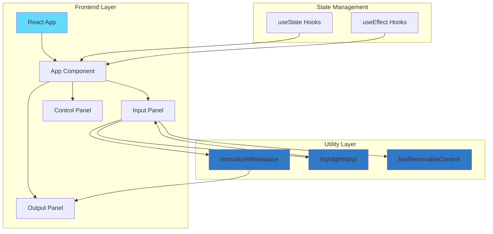
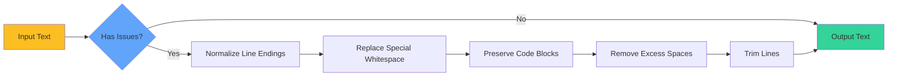
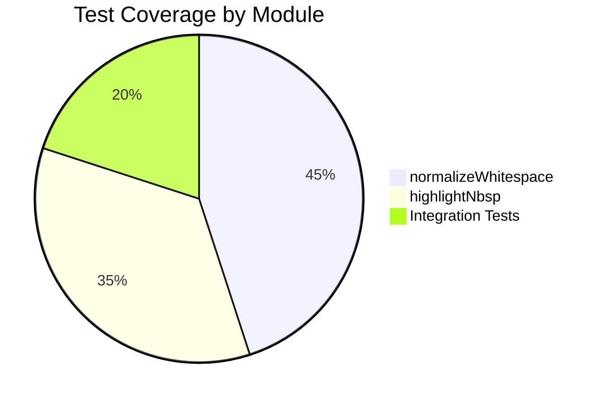
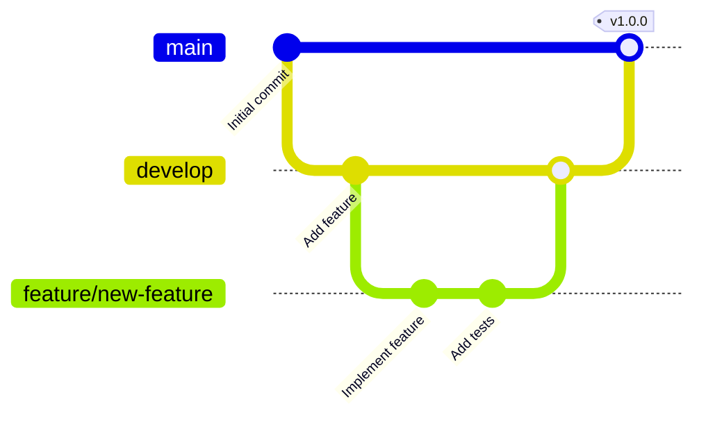

<div align="center">

# NbspNeutralizer

**A powerful web application for detecting and removing hidden whitespace characters and formatting artifacts from text**

[](https://www.typescriptlang.org/)
[](https://reactjs.org/)
[](https://vitejs.dev/)
[](LICENSE)

</div>

---

## 🎯 Overview

A modern web application designed to identify and normalize problematic whitespace characters in text. It detects non-breaking spaces (NBSP), zero-width characters, excessive spacing, and other hidden formatting artifacts that can cause issues in text processing, AI-generated content, and document formatting.

### Problem Statement



---

## ✨ Features

### Core Functionality

- **🔍 Real-time Detection** - Instantly identifies problematic whitespace characters
- **🎨 Visual Highlighting** - Color-coded display of issues in the input text
- **🧹 Smart Normalization** - Intelligently cleans text while preserving meaning
- **📊 Character Counter** - Live character count for both input and output
- **📋 One-Click Copy** - Quick clipboard integration for cleaned text
- **🔄 Reset Function** - Easy reset to start fresh

### Detected Issues



---

## 🏗️ Architecture

### System Architecture


---

## 🚀 Getting Started

### Prerequisites

- Node.js (v18 or higher)
- npm or yarn package manager

### Installation

```bash
# Clone the repository
git clone https://github.com/rajtilak-2020/NONBSP.git

# Navigate to project directory
cd NONBSP

# Install dependencies
npm install
```

### Development

```bash
# Start development server
npm run dev

# Run tests
npm test

# Run tests with UI
npm run test:ui

# Type checking
npm run typecheck

# Lint code
npm run lint
```

### Build

```bash
# Build for production
npm run build

# Preview production build
npm run preview
```

---

## 💻 Usage

### Basic Usage

1. **Paste Text**: Copy and paste your text into the left input panel
2. **View Issues**: Click "Show Issues" to highlight problematic characters
3. **Review Output**: Check the cleaned text in the right output panel
4. **Copy Result**: Click "Copy Cleaned Text" to copy the normalized text

### Processing Pipeline



---

**Detected Characters:**
- Non-breaking spaces: `\u00A0`, `\u202F`, `\u2007`
- Zero-width characters: `\u200B`, `\u2060`, `\u180E`, `\uFEFF`
- Various space types: `\u2000-\u200A`, `\u205F`, `\u3000`

#### highlightNbsp Function

Provides visual feedback by segmenting text into:
- **Normal segments**: Regular text content
- **Removed segments**: Problematic characters marked for removal

### File Structure

```
NONBSP/
├── public/
│   ├── favicon.png
│   └── og-image.webp
├── src/
│   ├── utils/
│   │   ├── normalizeWhitespace.ts      # Core normalization logic
│   │   ├── normalizeWhitespace.test.ts # Unit tests
│   │   ├── highlightNbsp.ts            # Highlighting logic
│   │   └── highlightNbsp.test.ts       # Unit tests
│   ├── App.tsx                         # Main application component
│   ├── main.tsx                        # Application entry point
│   ├── index.css                       # Global styles
│   └── vite-env.d.ts                   # Vite type definitions
├── package.json
├── vite.config.ts
├── vitest.config.ts
├── tsconfig.json
└── tailwind.config.js
```

---

## 🧪 Testing

### Test Coverage



### Running Tests

```bash
# Run all tests
npm test

# Run tests in watch mode
npm test -- --watch

# Run tests with coverage
npm test -- --coverage

# Open test UI
npm run test:ui
```

### Test Cases

- ✅ Line ending normalization (CRLF → LF)
- ✅ Special whitespace character replacement
- ✅ Multiple space reduction
- ✅ Excessive newline limiting
- ✅ Code block preservation
- ✅ Edge cases (empty strings, null values)

---

## 🤝 Contributing

Contributions are welcome! Please follow these steps:

1. Fork the repository
2. Create a feature branch (`git checkout -b feature/AmazingFeature`)
3. Commit your changes (`git commit -m 'Add some AmazingFeature'`)
4. Push to the branch (`git push origin feature/AmazingFeature`)
5. Open a Pull Request

### Development Workflow



---

## 📄 License

This project is licensed under the MIT License - see the [LICENSE](LICENSE) file for details.

---

## 👨‍💻 Author

**K Rajtilak**

- GitHub: [@rajtilak-2020](https://github.com/rajtilak-2020)
- Project Link: [https://github.com/rajtilak-2020/NONBSP](https://github.com/rajtilak-2020/NONBSP)

---

## 🙏 Acknowledgments

- React team for the amazing framework
- Vite for blazing fast build tooling
- Tailwind CSS for utility-first styling
- Lucide for beautiful icons
- The open-source community

---

<div align="center">

**Made with ❤️ by K Rajtilak**

⭐ Star this repository if you find it helpful!

</div>
